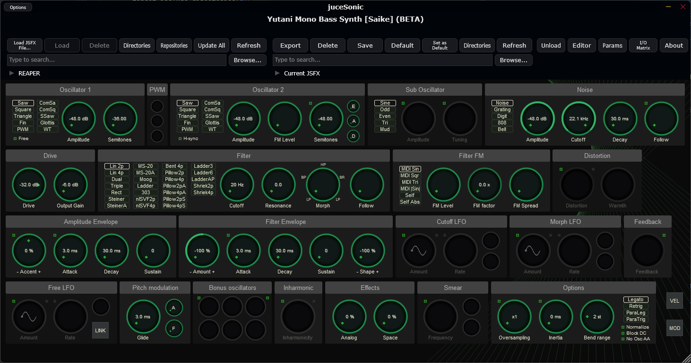
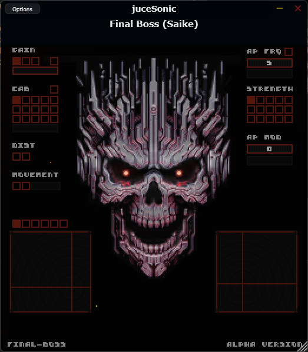

# juceSonic

JSFX host and plugin built with JUCE.

## Features

- **Plugin Formats**: VST3, AU (macOS), and Standalone
- **MIDI Support**: MIDI input/output processing
- **JSFX Graphics**: Native JSFX graphics rendering
- **I/O Routing**: Input/Output channel matrix routing
- **Full Screen Mode**: Toggle with F (window) or F11
- **Preset Management**: Save, load and export presets
- **ReaPack Support**: Import JSFX from ReaPack compatible repositories
- **Repository & Preset Search**: Quick search with Ctrl+F
- **JSFX Editor**: Built-in code editor for JSFX scripts
- **Download Indicator**: Visual feedback for package downloads
- **ASIO Support**: Available on Windows when building from source

## Screenshots




## Building

Requires CMake 3.28+ and Ninja.

```bash
cmake -B build -G Ninja -DCMAKE_BUILD_TYPE=Release
cmake --build build
```
